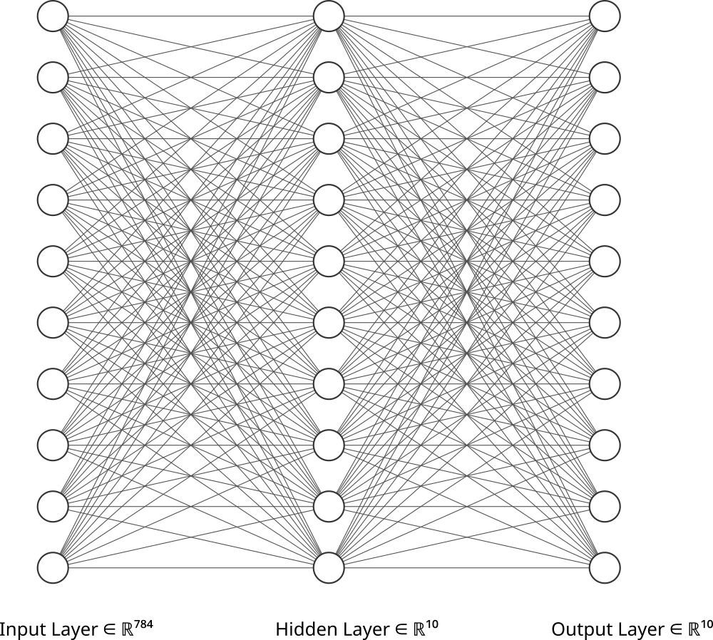
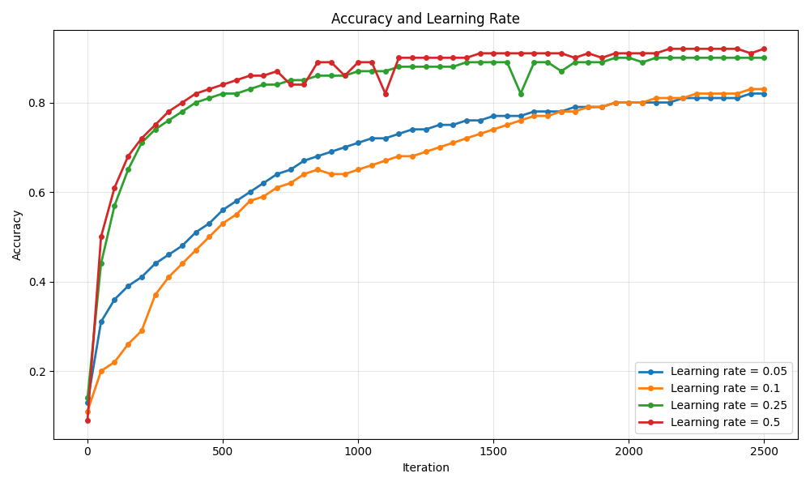
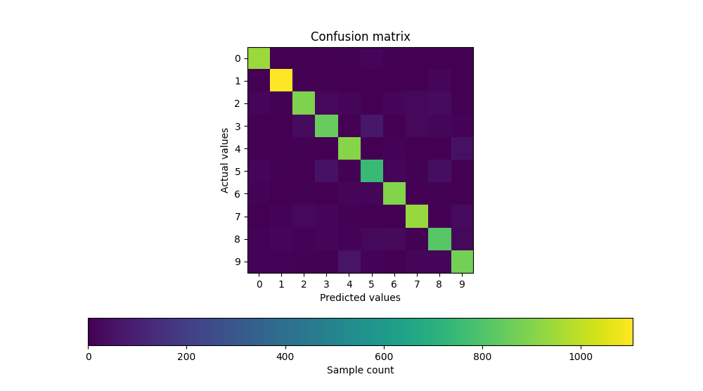
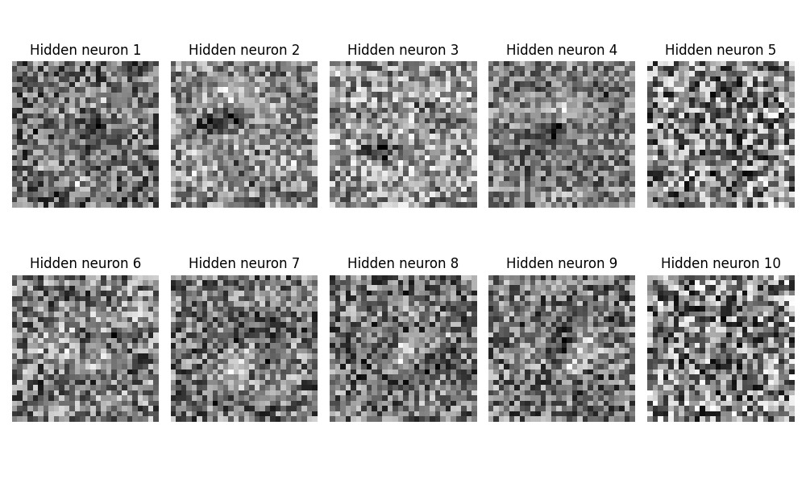

# Building a Neural Network from Scratch

## Introduction

> [!NOTE]
> This repository is a follow up of the ideas presented by **Samson Zhang** in his amazing: [Building a neural network from scratch](https://www.youtube.com/watch?v=w8yWXqWQYmU) video. Watch it before digging into the project is highly recommended. Here we try to give the project a second look, rebuilding it with classes and classic Python files instead of using a notebook.

This project is a **from scratch** implementation of a simple neural network built entirely in Python using only basic libraries like NumPy. Its purpose is educational: to help you understand how neural networks actually work under the hood; not just how to call them from high level frameworks like TensorFlow or PyTorch.

## The Goal

The goal of the network is to recognize handwritten digits using the MNIST dataset: a classic collection of 70,000 images of digits from 0 to 9. Each image is small (28×28 pixels) and grayscale, making MNIST an ideal starting point for learning how image classification works. It's simple enough to understand quickly but rich enough to show the key ideas behind modern machine learning.

The idea is to demystify key concepts such as forward propagation, backpropagation, activation functions and gradient descent by showing exactly how they are implemented in code. You'll learn how data flows through the network, how predictions are made and how the network adjusts itself through learning.

By the end of this project, you will:

* Understand the core mathematical operations that make neural networks work.
* Be able to write and modify your own simple networks.
* Have a clearer sense of what modern frameworks are doing behind the scenes.

This repository is designed for beginners and self-learners who want to move from theory to practical understanding. You don't need a background in deep learning or advanced math; just a bit of curiosity, basic Python knowledge and a willingness to experiment.

## The Architecture

Our neural network is designed with simplicity and educational clarity in mind, featuring a minimalist three-layer structure:

### Layer Breakdown

| Layer | Neurons | Purpose |
|-------|---------|---------|
| Input Layer | 784 | Represents the flattened 28×28 pixel MNIST image |
| Hidden Layer | 10 | Applies non-linear transformations to extract features |
| Output Layer | 10 | Predicts the probability of each digit (0-9) |

> [!TIP]
> For a deep dive into the mathematical foundations of this architecture, refer to the [detailed mathematical documentation](docs/the-math.md).



### Mathematical Foundations

The network implements key machine learning concepts:

- Forward Propagation
- Activation Functions (ReLU and Softmax)
- Loss Function (Cross-Entropy)
- Backpropagation
- Gradient Descent

Each of these concepts is meticulously implemented to provide a transparent view of neural network mechanics.

## Usage

### Download

To use the repository, first manually download it or clone it using git:

```bash
git clone https://github.com/elcapo/neural-network-from-scratch.git
cd neural-network-from-scratch.git
```

### Install

Once you have the code, you'll need to install its dependencies.

#### Create a Virtual Environment

Before doing so, creating a Python virtual environment is recommended:

```bash
python -m venv .venv
```

#### Activate the Virtual Environment

After creating the virtual environment, you need to activate it so that you can start using it:

```bash
source .venv/bin/activate
```

#### Install the Dependencies

To install all the dependencies, just run:

```bash
pip install -r requirements.txt
```

#### Uncompress the Datasources

Finally, uncompress the datasources:

```bash
cd resources/data/
unzip mnist_test.zip
unzip mnist_train.zip
```

### Train

To run the training you can use the convenience script `train.py` that's located at the root of the project:

```bash
python train.py
```

This will store the model weights and biases in the `resources/weights_and_biases.json` file.

### Evaluate

To run the evaluation of your trained model, use the `evaluate.py` script:

```bash
python evaluate.py
```

#### Hyperparameter Tuning

The `hyper-tune.py` script helps finding the best learning rate for the model. It executes the training method for a certain number of iterations with different learning rate values and then plot them.

```bash
python hyper-tune.py
```

Here's a real example of its output:



#### Evaluation

In order to get an idea of how good the model is, a `evaluate.py` script has been included in the root of the project.

```bash
python evaluate.py
```

Running it will output the model's accuracy, confusion matrix and binary confusion matrix.

These were the results of running the evaluation with the weights that are stored in [resources/weights_and_biases.json](resources/weights_and_biases.json):

##### Accuracy

The mean accuracy of the model in the test set is: **90%**.

##### Confusion Matrix



#### Inspection

To satisfy the curiosity of the hungry minds, an additional script was added that visualizes the weights of the hidden layer.

```bash
python plot_weights.py
```



This was added as a reminder that although the network is simple and small, its learning has a random side that may make it hard to interpret.

## Test

There is a test suite available that can be executed with Pytest:

```bash
pytest -vvv
```

### Coverage

The Pytest Coverage plugin is also installed, so a test coverage report can easily be obtained:

```bash
pytest --cov-report term-missing --cov=nn_from_scratch tests/
```
