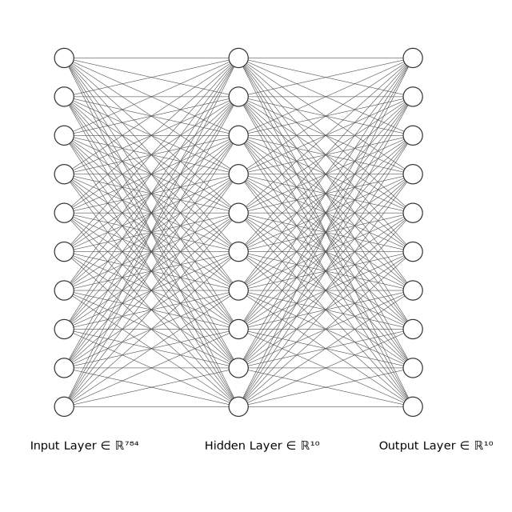

# Building a Neural Network from Scratch

This repository contains my own take of Samson Zhang's [Building a neural network from scratch](https://www.youtube.com/watch?v=w8yWXqWQYmU) Youtube video. The goal of the project is to implement a neural network that can solve the MNIST dataset without Tensorflow or Pytorch.

## The MNIST dataset

The MNIST dataset consists of 70,000 images of handwritten digits, each 28×28 pixels, along with their corresponding labels (0–9).

## The Architecture

We'll maintain the structure suggested in the video, with:

1. an input layer of 784 neurons
2. a hidden layer of 10 neurons
3. an output layer of 10 neurons

The hidden layer size is kept small for simplicity; in practice, larger layers improve accuracy. The output layer represents how likely our model thinks that the input represents each of the 10 possible digits.



## The Math

### Forward Propagation

#### Input Layer

If $m$ is the number of samples in a batch, then our input matrix $\mathbf{X}_i$ has one sample per column.

$$
    \mathbf{X}_i
$$

The input layer represents this tensor without any modification. 

##### Dimensions

* $\mathbf{X}_i$ has dimensions $(784, m)$

#### Hidden Layer

Once the input value is passed to the hidden layer, its value will be transformed by both the layer weights $\mathbf{W}_h$ and its biases $\mathbf{b}_h$ and then activated by a $ReLU$ function.

$$
    \mathbf{Z}_h = \mathbf{W}_h \mathbf{X}_i + \mathbf{b}_h
$$

$$
    \mathbf{A}_h = ReLU(\mathbf{Z}_h)
$$

##### Dimensions

* $\mathbf{W}_h$ has dimensions $(10, 784)$
* $\mathbf{b}_h$ has dimensions $(10, 1)$
* $\mathbf{Z}_h$ has dimensions $(10, m)$
* $\mathbf{A}_h$ has dimensions $(10, m)$

##### Activation

The definition of the $ReLU$ function is:

```math
    ReLU(z) =

    \begin{cases}
        0 & \text{if } z <= 0 \\
        z & \text{if } z > 0
    \end{cases}
```

#### Output Layer

The activated value of the hidden layer is finally passed to the output layer, where its value will be transformed by both the layer weigths $\mathbf{W}_o$ and its biases $\mathbf{b}_o$ and then activated by a $Softmax$ function.

$$
    \mathbf{Z}_o = \mathbf{W}_o \mathbf{A}_h + \mathbf{b}_o
$$

$$
    \mathbf{A}_o = Softmax(\mathbf{Z}_o)
$$

##### Dimensions

* $\mathbf{W}_o$ has dimensions $(10, 10)$
* $\mathbf{b}_o$ has dimensions $(10, 1)$
* $\mathbf{Z}_o$ has dimensions $(10, m)$
* $\mathbf{A}_o$ has dimensions $(10, m)$

##### Activation

The definition of the $Softmax$ function is:

$$
    Softmax(\mathbf{z})_i = \frac{e^z_i}{\sum_{j} e^{z_j}}
$$

### Loss Function

Before we start with the backward propagation, we'll need to be able to check how much each of our predictions, $\mathbf{A}\_o$, deviated from the real result $\mathbf{y}_{real}$.

But our predictions, for each case, are vectors of 10 elements with values that range from 0 to 1 and the real results are single digits. To have comparable results, we have to convert single digit values to lists of 10 elements valued between 0 and 1. That transformation is called $OneHotEncode$:

| $y$ | $OneHotEncode(y)$ |
| --- | --- |
| 0 | (1, 0, 0, 0, 0, 0, 0, 0, 0, 0) |
| 1 | (0, 1, 0, 0, 0, 0, 0, 0, 0, 0) |
| 2 | (0, 0, 1, 0, 0, 0, 0, 0, 0, 0) |
| 3 | (0, 0, 0, 1, 0, 0, 0, 0, 0, 0) |
| 4 | (0, 0, 0, 0, 1, 0, 0, 0, 0, 0) |
| 5 | (0, 0, 0, 0, 0, 1, 0, 0, 0, 0) |
| 6 | (0, 0, 0, 0, 0, 0, 1, 0, 0, 0) |
| 7 | (0, 0, 0, 0, 0, 0, 0, 1, 0, 0) |
| 8 | (0, 0, 0, 0, 0, 0, 0, 0, 1, 0) |
| 9 | (0, 0, 0, 0, 0, 0, 0, 0, 0, 1) |

In order to measure the difference between our predictions and the real values, we'll be using the cross entropy function, which, for each of the elements of our predictions, can be expressed like:

$$
    L = - \sum_{i=1}^{10} y_i \log{a_i}
$$

In this expression $y_i$ represents a single value ($0$ or $1$) taken from $OneHotEncode(\mathbf{y}_{real})$ and $a_i$ represents a single value (in this case from $0$ to $1$) taken from $\mathbf{A}_o$.

> [!NOTE]
> The factor $\frac{1}{m}$ is applied later when computing parameter gradients to average over the batch.

To compute the backpropagation, we'll need to start by obtaining an expression for the derivative of the loss function with respect to $z_i$:

$$
    \frac{\partial L}{\partial z_i}
$$

But before we compute that, we already know that we'll need to compute the partial derivative of the softmax function first.

#### Derivative of the Softmax Function

To understand how to [derivate the softmax function](https://www.youtube.com/watch?v=09c7bkxpv9I), we'll consider a case were its input vector has only 3 elements: $\mathbf{Z} = (z_1, z_2, z_3)$. Our simplified softmax, for one of those elements would look like this:

$$
    s(z_1) = \frac{e^{z_1}}{\Sigma}
$$

Where we defined $\Sigma$ to make the expression shorter:

$$
    \Sigma = e^{z_1} + e^{z_2} + e^{z_3}
$$

To get the derivative of this expresion with regard to $z_1$ we'll apply the rule of the derivative of fractions. Given a function $h(x) = \frac{f(x)}{g(x)}$, its derivative with respect to $x$ is:

$$
    \frac{\partial h(x)}{\partial x} = \frac{f'(x)g(x) - g'(x)f(x)}{g(x)^2}
$$

If we apply this to the derivative of the softmax, we get:

```math
\begin{aligned}

    & \frac{\partial s(z_1)}{\partial z_1} = \frac{e^{z_1}\Sigma - e^{2 z_1}}{\Sigma^2} = s(z_1) (1 - s(z_1)) \\

    \\

    & \frac{\partial s(z_2)}{\partial z_1} = \frac{- e^{z_1} e^{z_2}}{\Sigma^2} = - s(z_1) s(z_2)

\end{aligned}
```

Now, we won't be as surprised when we see that this generalizes to:

```math
    \frac{\partial s(z_i)}{\partial z_j} =

    \begin{cases}
        s(z_i)(1 - s(z_i)) & \text{if } i = j \\
        - s(z_i) s(z_j) & \text{if } i \neq j
    \end{cases}
```

Which is usually simplified by introducing a [Kronecker's delta function](https://en.wikipedia.org/wiki/Kronecker_delta):

$$
    \frac{\partial s(z_i)}{\partial z_j} = s(z_i) (\delta_{ij} - s(z_j))
$$

#### Derivative of the Loss Function

We now compute the derivative of the loss with respect to each of the output layer's logits $\frac{\partial L}{\partial z_j}$.

$$
    \frac{\partial L}{\partial z_j} = - \sum_{i=1}^{10} y_i \frac{\partial}{\partial z_j} \log{a_i}
$$

We'll start by replacing:

$$
    \frac{\partial}{\partial z_j} \log{a_i} = \frac{1}{a_i} \frac{\partial a_i}{\partial z_j} = \frac{1}{a_i} a_i (\delta_{ij} - a_j)
$$

What takes us to:

$$
    \frac{\partial L}{\partial z_j} = - \sum_{i=1}^{10} y_i (\delta_{ij} - a_j)
$$

Since $\delta_{ij}$ equals 1 only when $i=j$, all other terms vanish, leaving:

$$
    \frac{\partial L}{\partial z_j} = - y_j + \sum_{i=1}^{10}y_i a_j
$$

Finally, as $\sum_{i} y_i = 1$:

$$
    \frac{\partial L}{\partial z_j} = a_j - y_j
$$

This result means that the gradient for each output neuron is simply the difference between its predicted probability and the true label.

### Backward Propagation

#### Output Layer

We'll now start by finding the difference $d\mathbf{Z}_o$ between our $\mathbf{A}_o$ and the one-hot encoded real results:

$$
    d\mathbf{Z}_o = \mathbf{A}_o - OneHotEncode(\mathbf{y}_{real})
$$

> [!NOTE]
> Note that we could write here $d\mathbf{Z}_o$ as $\frac{\partial \mathbf{L}_o}{\partial \mathbf{z}}$ but we'll use the first option as it keeps the notation simpler.

##### Dimensions

* $d\mathbf{Z}_o$ has the same dimensions as $\mathbf{Z}_o$ $(10, m)$
* $OneHotEncode(\mathbf{y_{real}})$ has dimensions $(10, m)$
* $\mathbf{y}_{real}$ has dimensions $(1, m)$

Once $d\mathbf{Z}_o$ is known the gradients of the weights and biases follow:

$$
    d\mathbf{W}_o = \frac{1}{m} d\mathbf{Z}_o \mathbf{A}_h^T
$$

$$
    d\mathbf{b}_o = \frac{1}{m} \sum d\mathbf{Z}_o
$$

##### Dimensions

* $d\mathbf{W}_o$ has the same dimensions as $\mathbf{W}_o$ $(10, 10)$
* $\mathbf{A}_h$ has dimensions $(m, 10)$
* $d\mathbf{b}_o$ has the same dimensions as $\mathbf{b}_o$ $(10, 1)$

#### Hidden Layer

To backpropagate the error through the hidden layer, we start by computing the gradient of the loss with respect to the hidden layer’s activation, which we already defined as:

$$
    d\mathbf{A}_h = \mathbf{W}_o^T d\mathbf{Z}_o
$$

Next, we need the gradient with respect to the hidden layer’s pre-activation values $\mathbf{Z}_h$. Since the hidden layer uses the ReLU activation function, we apply its derivative element-wise:

$$
    d\mathbf{Z}_h = d\mathbf{A}_h \odot ReLU' (d{\mathbf{Z}_h})
$$

Where $\odot$ represents the element-wise (Hadamard) product and $ReLU'$ is given by:

```math
    ReLU'(z) =

    \begin{cases}
        0 & \text{if } z <= 0 \\
        1 & \text{if } z > 0
    \end{cases}
```

Once we have $d\mathbf{Z}_h$, we can compute the gradients of the weights and biases for the hidden layer:

$$
    d\mathbf{W}_h = \frac{1}{m} d\mathbf{Z}_h \mathbf{X}_i^T
$$

$$
    d\mathbf{b}_h = \frac{1}{m} \sum d\mathbf{Z}_h
$$

##### Dimensions

* $d\mathbf{Z}_h$ has the same dimensions as $\mathbf{Z}_h$ $(10, m)$
* $d\mathbf{W}_h$ has the same dimensions as $\mathbf{W}_h$ $(10, 784)$
* $d\mathbf{b}_h$ has the same dimensions as $\mathbf{b}_h$ $(10, 1)$

### Gradient Descent

Once all gradients are computed, the final step of backpropagation is to update the network’s parameters so that the loss decreases in the next iteration.

Each weight and bias matrix is adjusted in the opposite direction of its gradient, scaled by a small constant called the learning rate ($\eta$):

$$
\begin{aligned}
    & \mathbf{W}_o \leftarrow \mathbf{W}_o - \eta  d\mathbf{W}_o \\
    & \mathbf{b}_o \leftarrow \mathbf{b}_o - \eta  d\mathbf{b}_o \\
    & \mathbf{W}_h \leftarrow \mathbf{W}_h - \eta  d\mathbf{W}_h \\
    & \mathbf{b}_h \leftarrow \mathbf{b}_h - \eta  d\mathbf{b}_h
\end{aligned}
$$

At each training step (or epoch), the network computes predictions through forward propagation, measures the loss, computes all gradients through backward propagation and updates the parameters using these equations.

Over time, this process gradually reduces the loss and improves accuracy.

## Usage

### Download

To use the repository, first manually download it or clone it using git:

```bash
git clone https://github.com/elcapo/neural-network-from-scratch.git
cd neural-network-from-scratch.git
```

### Install

Once you have the code, you'll need to install its dependencies.

#### Create a Virtual Environment

Before doing so, creating a Python virtual environment is recommended:

```bash
python -m venv .venv
```

#### Activate the Virtual Environment

After creating the virtual environment, you need to activate it so that you can start using it:

```bash
source .venv/bin/activate
```

#### Install the Dependencies

To install all the dependencies, just run:

```bash
pip install -r requirements.txt
```

#### Uncompress the Datasources

Finally, uncompress the datasources:

```bash
cd resources/data/
unzip mnist_test.zip
unzip mnist_train.zip
```

### Train

To run the training you can use the convenience script `train.py` that's located at the root of the project:

```bash
python train.py
```

#### Hyperparameter Tuning

The `hyper-tune.py` script helps finding the best learning rate for the model. This process will output a single JSON file per iteration with the properties `learning_rate`, `iteration` and `accuracy`. The output can easily be stored as a **jsonl** file:

```bash
python hyper-tune.py > resources/data/training-report.jsonl
```

Then the [accuracies-and-learning-rates.ipynb](resources/accuracies-and-learning-rates.ipynb) notebook can be used to plot them and choose the best one. Here's a real example of its output:


## Test

There is a test suite available that can be executed with Pytest:

```bash
pytest -vvv
```

### Coverage

The Pytest Coverage plugin is also installed, so a test coverage report can easily be obtained:

```bash
pytest --cov-report term-missing --cov=nn_from_scratch tests/
```